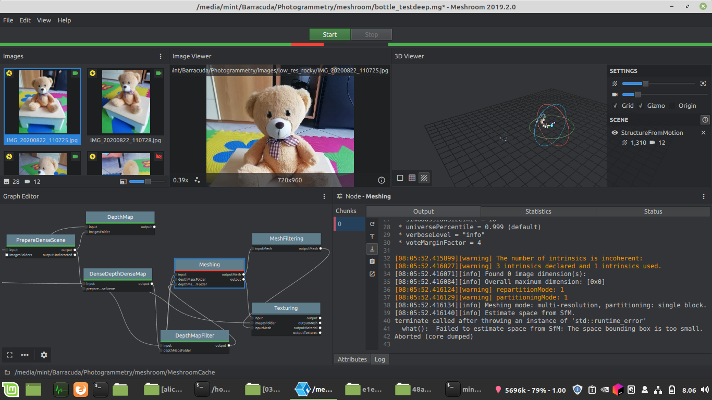

# Meshroom Node
this folder is the code to include the model as meshroom node

## Requirements
* python >= 3.6
* numpy
* torch
* OpenEXR that also need `sudo apt install libopenexr-dev`

## Install on Meshroom
* clone the repo
* put meshroom/DenseDepthDeepMap.py into the libs/meshroom/nodes/aliceVision folder
* edit in that file the absolute path of the meshroom/main.py
* Restart Meshroom
* add in your flow as DeepMap block

